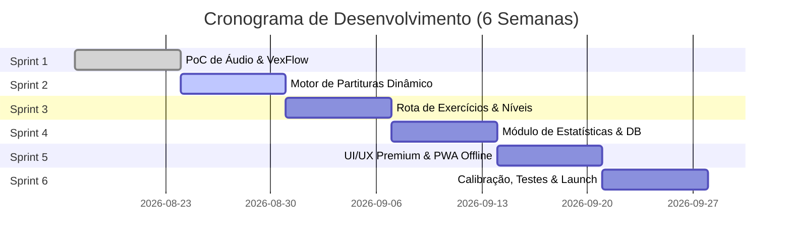

# 🎼 MusicTrainer — Plano de Ação Completo para App de Sight Reading

Plano de ação estratégico e técnico para o desenvolvimento de um aplicativo web/mobile moderno, ultrarrápido e interativo para **treinamento de leitura de partituras à primeira vista (Sight Reading)**, equipado com rota progressiva de exercícios, detecção de notas em tempo real via microfone e análises estatísticas avançadas.

---

## 📋 Sumário
1. [Visão Geral e Proposta de Valor](#1-visão-geral-e-proposta-de-valor)
2. [Arquitetura Tecnológica e Stack Recomendada](#2-arquitetura-tecnológica-e-stack-recomendada)
3. [Arquitetura do Sistema e Fluxo de Áudio em Tempo Real](#3-arquitetura-do-sistema-e-fluxo-de-áudio-em-tempo-real)
4. [Módulo de Áudio & Detecção de Afinação (Pitch Engine)](#4-módulo-de-áudio--detecção-de-afinação-pitch-engine)
5. [Motor de Partituras Dinâmico (Sheet Music Rendering)](#5-motor-de-partituras-dinâmico-sheet-music-rendering)
6. [Rota Metodológica de Exercícios (Trilha de Aprendizado)](#6-rota-metodológica-de-exercícios-trilha-de-aprendizado)
7. [Módulo de Estatísticas e Análise de Desempenho](#7-módulo-de-estatísticas-e-análise-de-desempenho)
8. [Design de Interface (UI/UX) & Experiência do Usuário](#8-design-de-interface-uiux--experiência-do-usuário)
9. [Modelagem de Dados e Armazenamento Local-First](#9-modelagem-de-dados-e-armazenamento-local-first)
10. [Plano de Ação Executivo (Cronograma Sprint por Sprint)](#10-plano-de-ação-executivo-cronograma-sprint-por-sprint)
11. [Matriz de Riscos Técnicos e Estratégias de Mitigação](#11-matriz-de-riscos-técnicos-e-estratégias-de-mitigação)
12. [Checklist de Qualidade & Métricas de Sucesso (KPIs)](#12-checklist-de-qualidade--métricas-de-sucesso-kpis)

---

## 🎯 1. Visão Geral e Proposta de Valor

### 1.1 Objetivo do Produto
Criar uma plataforma de treinamento de leitura musical à primeira vista que combine **resposta instantânea ao áudio do microfone**, **geração dinâmica de partituras** e **feedback adaptativo**, permitindo que músicos (iniciantes a profissionais de diversos instrumentos) desenvolvam fluência de leitura rápida e precisa.

### 1.2 Pilares Fundamentais
* **⚡ Alta Performance & Baixa Latência**: Processamento de áudio em thread dedicada (`AudioWorklet`) com resposta visual instantânea (<50ms).
* **🎯 Precisão na Detecção**: Algoritmos de afinação (YIN/MPM) capazes de identificar notas de instrumentos de corda, sopro, teclas e voz em tempo real.
* **🗺️ Trilha Gamificada & Adaptativa**: Algoritmo de Repetição Espaçada que adapta os exercícios de acordo com as notas de maior dificuldade do usuário.
* **📊 Diagnóstico Detalhado**: Métricas de tempo de reação por nota (ms), desvio de afinação (cents), mapa de calor da pauta e histórico de acertos.
* **📱 Local-First & Offline Ready**: Funcionamento 100% offline via PWA, garantindo praticidade em salas de estudo e estúdios sem internet.

---

## 🛠️ 2. Arquitetura Tecnológica e Stack Recomendada

| Camada | Tecnologia Escolhida | Justificativa Técnica |
| :--- | :--- | :--- |
| **Frontend Framework** | **React 19 + Vite + TypeScript** | Inicialização ultrarrápida, tipagem estática rigorosa para estruturas musicais e ecossistema moderno. |
| **Renderização Musical** | **VexFlow 4.x / 5.x** | Renderização vetorial (SVG/Canvas) direta, leve, flexível e ideal para alterar cores de notas em tempo real. |
| **Processamento de Áudio** | **Web Audio API + AudioWorklet** | Leitura contínua do microfone fora da Main Thread, evitando travamentos na renderização visual. |
| **Algoritmo de Pitch** | **YIN / MPM via WebAssembly (WASM)** ou `pitchy` | Algoritmo de autocorrelação com alta acurácia para frequências fundamentais (A0 a C8) e rejeição de ruído. |
| **Estilização / UI** | **Tailwind CSS + Vanilla CSS Variables** | Tema dark neon premium, alta customização visual e suporte fluido a glassmorphism. |
| **Animações** | **Framer Motion** | Transições de tela suaves, animações de micro-feedback e feedback de nível concluído. |
| **Persistência de Dados** | **Dexie.js (IndexedDB)** | Armazenamento local estruturado e ultrarrápido para sessões, histórico de notas e progresso. |
| **Visualização de Dados** | **Recharts / Chart.js** | Gráficos responsivos de evolução, tempo de reação e mapas de calor de precisão. |
| **PWA / Service Worker** | **Vite PWA Plugin** | Cache inteligente de assets e scripts para funcionamento offline completo. |

---

## 🏗️ 3. Arquitetura do Sistema e Fluxo de Áudio em Tempo Real

```mermaid
graph TD
    subgraph Client UI - Main Thread (60 FPS)
        A[Interface do Usuário / React] --> B[VexFlow Sheet Music Render]
        A --> C[Dashboard & Rota de Exercícios]
        B --> D[Visualizador de Nota Atual / Feedback Verde-Vermelho]
    end

    subgraph Audio Subsystem - Background Threads
        E[Entrada de Áudio / Microfone] --> F[AudioContext / MediaStream]
        F --> G[Filtro Passa-Alta & Noise Gate]
        G --> H[AudioWorkletProcessor Thread]
        H --> I[Pitch Engine: YIN Algorithm in WASM/JS]
        I -->|Frequência Hz, Nota, Cents, RMS| J[Audio Engine Emitter]
    end

    J -->|PostMessage| A
    D --> K[Registrador de Desempenho / Dexie.js]
    K --> L[Módulo de Estatísticas & Adaptabilidade]
```

### Explicação do Fluxo de Tempo Real:
1. O fluxo de áudio entra pelo microfone e é filtrado por um nó de corte de graves (eliminando ruídos mecânicos e de ar abaixo de 60Hz).
2. O **AudioWorklet** captura amostras em janelas deslizantes (ex: 2048 amostras).
3. O **Pitch Engine** calcula a Frequência Fundamental ($F_0$), a nota musical correspondente (ex: $C4$), o desvio em *cents* (afinação) e o volume (RMS).
4. As métricas são enviadas para a Main Thread sem bloquear a renderização vetorial do VexFlow.
5. O motor da partitura altera a cor da nota esperada para verde (acerto) ou vermelho (erro) e dispara a próxima nota instantaneamente.

---

## 🎤 4. Módulo de Áudio & Detecção de Afinação (Pitch Engine)

### 4.1 Especificações do Processamento
* **Frequência de Amostragem**: 44.1 kHz ou 48 kHz.
* **Tamanho da Janela de Análise**: 2048 amostras (~46ms de latência teórica, otimizado com overlapping de 50% para respostas a cada 23ms).
* **Faixa de Frequência Alvo**: 65 Hz ($E2$) a 2093 Hz ($C7$), cobrindo a imensa maioria dos instrumentos e vozes.
* **Janela de Tolerância de Afinação**:
  * **Modo Mestre (Strict)**: $\pm 15$ cents.
  * **Modo Estudo (Standard)**: $\pm 30$ cents.
  * **Modo Iniciante (Flexible)**: $\pm 50$ cents (tolerância de até meio tom).

### 4.2 Algoritmo de Limpeza de Sinal (DSP Pre-processing)
1. **High-Pass Filter (60 Hz)**: Remove *humming* elétrico e barulhos de ar.
2. **Noise Gate Dinâmico**: Calcula o ruído de fundo da sala ao iniciar a sessão e ignora capturas com $RMS < Threshold$.
3. **Filtro de Mediana Temporarizada**: Exige estabilidade da mesma nota detectada por 3 buffers consecutivos (~60ms) para descartar ataques percussivos involuntários.
4. **Suporte a Instrumentos Transpositores**: Configuração global para ajustar a partitura para $B\flat$ (Trompete, Sax Tenor), $E\flat$ (Sax Alto) ou $F$ (Trompa).

---

## 🎼 5. Motor de Partituras Dinâmico (Sheet Music Rendering)

### 5.1 Requisitos de Renderização
* **Arquitetura de Nó SVG Direto**: Em vez de redesenhar todo o canvas a cada nota tocada, o componente manipulará as classes/atributos SVG dos elementos gerados pelo VexFlow para alternar cores das notas (neutro, correto, incorreto, ativo).
* **Modos de Exibição**:
  * **Modo Nota por Nota**: Exibe uma única pauta com 1 a 4 compassos; a partitura avança assim que a nota atual é identificada.
  * **Modo Scroll Horizontal Contínuo**: A partitura desliza da direita para a esquerda em ritmo constante acoplada a um metrônomo.
  * **Modo Leitura Tradicional de Sistema**: Exibe a partitura completa dividida em sistemas/páginas.

### 5.2 Recursos Visuais na Partitura
* **Auxílio Opcional (Modo Aprendiz)**: Exibição do nome da nota abaixo da pauta ou no braço do instrumento/teclado virtual.
* **Linha Guia de Leitura**: Cursor vertical animado indicando exatamente qual nota deve ser executada no momento.

---

## 🗺️ 6. Rota Metodológica de Exercícios (Trilha de Aprendizado)

A rota será dividida em **6 Grandes Fases Progressivas**, totalizando mais de 40 níveis detalhados:

```
[Fase 1: Claves Principais] ──> [Fase 2: Acidentes & Armaduras] ──> [Fase 3: Intervalos & Saltos]
                                                                          │
[Fase 6: Desafio Infinito] <── [Fase 5: Acordes & Polifonia] <── [Fase 4: Leitura Rítmica]
```

### Detalhamento dos Níveis:

#### **Fase 1: Fundamentos da Pauta (Notas Naturais)**
* **Nível 1.1**: Clave de Sol — Linhas Centrais ($E4, G4, B4, D5, F5$).
* **Nível 1.2**: Clave de Sol — Espaços ($F4, A4, C5, E5$).
* **Nível 1.3**: Clave de Fá — Linhas ($G2, B2, D3, F3, A3$).
* **Nível 1.4**: Clave de Fá — Espaços ($A2, C3, E3, G3$).
* **Nível 1.5**: Linhas Suplementares Superiores e Inferiores (Claves de Sol e Fá).
* **Nível 1.6**: Clave de Dó na 3ª e 4ª linhas (Viola / Trombone - opcional).

#### **Fase 2: Alterações & Armaduras de Clave**
* **Nível 2.1**: Sustenidos Acidentais ($\sharp$).
* **Nível 2.2**: Bemóis Acidentais ($\flat$) e Bequadros ($\natural$).
* **Nível 2.3**: Armaduras de Clave com até 2 Alterações ($G, D, F, B\flat$ Maior).
* **Nível 2.4**: Armaduras de Clave Intermediárias (até 4 Alterações).
* **Nível 2.5**: Armaduras Avançadas (até 7 Alterações / Escalas Cromáticas).

#### **Fase 3: Intervalos & Saltos Melódicos**
* **Nível 3.1**: Graus Conjuntos (Segundas Maiores e Menores).
* **Nível 3.2**: Saltos de Terça (Arpejos simples).
* **Nível 3.3**: Quartas e Quintas Justas.
* **Nível 3.4**: Sextas e Sétimas (Leitura rápida de grandes saltos).
* **Nível 3.5**: Mudança de Clave no mesmo exercício (Sol ⇄ Fá).

#### **Fase 4: Leitura Rítmica & Metrônomo Interativo**
* **Nível 4.1**: Semibreves e Mínimas com metrônomo visual/sonoro.
* **Nível 4.2**: Semínimas e Pausas simples.
* **Nível 4.3**: Colcheias e Sincopes.
* **Nível 4.4**: Semicolcheias e Notas Pontuadas.
* **Nível 4.5**: Métrica Composta ($6/8, 9/8, 12/8$).

#### **Fase 5: Polifonia & Acordes (Teclado / Violão)**
* **Nível 5.1**: Destaque de Tríades Fundamentais (Sol / Fá).
* **Nível 5.2**: Inversões de Acordes em pauta dupla (Grand Staff).
* **Nível 5.3**: Tétrades e Acordes com Sétima.

#### **Fase 6: Sight Reading Infinito & Gerador Adaptativo**
* **Nível 6.1**: **Modo Sobrevivência** — Leitura infinita com velocidade progressiva.
* **Nível 6.2**: **Treino Diário Personalizado** — Algoritmo seleciona 80% de notas com histórico de alta latência/erro do usuário e 20% de revisão.

---

## 📊 7. Módulo de Estatísticas e Análise de Desempenho

### 7.1 Métricas Coletadas em Cada Sessão
* **Precisão de Leitura (%)**: Percentual de notas tocadas corretamente na primeira tentativa.
* **Tempo de Reação Médio ($t_{reação}$ em ms)**: Tempo decorrido entre a apresentação da nota na tela e a emissão do som pelo músico.
* **Desvio Médio de Afinação (Cents)**: Acurácia de afinação do instrumento em relação ao A=440Hz.
* **Taxa de Erro por Nota / Clave**: Identificação precisa de notas problemáticas (ex: o usuário demora $850\text{ms}$ para ler o $D3$ na Clave de Fá, mas apenas $250\text{ms}$ para o $C4$).

### 7.2 Componentes Visuais do Painel de Estatísticas
1. **Mapa de Calor da Pauta (Staff Heatmap)**: Representação visual da pauta onde cada nota é colorida de verde (resposta rápida) a vermelho escuro (alta taxa de erro/lenteza).
2. **Gráfico de Evolução de Velocidade**: Gráfico de linha mostrando a queda do tempo de reação em milissegundos ao longo das semanas.
3. **Indicador de Streak & Consistência**: Dias consecutivos praticados e minutos totais acumulados.
4. **Radar de Habilidades Musicais**: Gráfico tipo *Spider/Radar* cobrindo 5 eixos: Clave de Sol, Clave de Fá, Acidentes, Saltos e Ritmo.

---

## 🎨 8. Design de Interface (UI/UX) & Experiência do Usuário

### 8.1 Diretrizes Estéticas
* **Tema Visual**: Dark Mode Premium com acentos em cores neon vibrantes (Cyan `#00F2FE`, Emerald `#10B981`, Purple `#8B5CF6`).
* **Design de Baixa Distração**: Durante o treino, a interface oculta menus e foca exclusivamente na partitura, afinador e feedback visual.
* **Micro-interações Suaves**: Animações de conquista ao completar níveis, efeitos de pulso no metrônomo e transições de cor não agressivas na partitura.

### 8.2 Principais Telas do Aplicativo
1. **Home / Mapa da Trilha**: Caminho vertical estilizado com nós interativos de fases, estrelas e marcador de progresso.
2. **Estúdio de Treino (Main Practice Screen)**:
   * Header compacto com nível atual, pontuação e botão de pausa.
   * Árvore centralizada de renderização do VexFlow com iluminação responsiva.
   * Footer com Tuner Gauge (exibindo Hz e cents em tempo real), controle de volume do microfone e metrônomo.
3. **Tela de Resultado da Sessão**: Resumo com pontuação, estrelas conquistadas, notas que precisam de atenção e botão "Tentar Novamente" ou "Próximo Nível".
4. **Hub de Estatísticas**: Painel com relatórios avançados, mapas de calor e histórico filtrável por período.
5. **Configurações de Áudio & Instrumento**: Seleção de dispositivo de entrada, calibração A440Hz, transposição de instrumento e sensibilidade do microfone.

---

## 🗄️ 9. Modelagem de Dados e Armazenamento Local-First

### 9.1 Schemas de Dados (TypeScript / Dexie.js)

```typescript
// Banco de Dados: MusicTrainerDB

export interface UserProfile {
  id: string; // 'default_user'
  name: string;
  transposition: 'C' | 'Bb' | 'Eb' | 'F';
  a4Frequency: number; // 440 por padrão
  toleranceCents: number; // 30 por padrão
  streakDays: number;
  lastActiveDate: string; // 'YYYY-MM-DD'
}

export interface LevelProgress {
  levelId: string; // ex: 'level_1_2'
  status: 'locked' | 'unlocked' | 'completed';
  stars: number; // 0 a 3
  highScore: number;
  bestAccuracy: number; // 0 a 100%
  completedAt?: number; // timestamp
}

export interface NoteStat {
  noteKey: string; // ex: 'C4_treble', 'F#3_bass'
  totalAttempts: number;
  successfulAttempts: number;
  totalResponseTimeMs: number;
  avgResponseTimeMs: number;
  avgCentsOffset: number;
}

export interface SessionHistory {
  id?: number; // Autoincrement
  timestamp: number;
  levelId: string;
  durationSeconds: number;
  accuracyPercentage: number;
  avgResponseTimeMs: number;
  notesLogged: Array<{
    noteKey: string;
    isCorrect: boolean;
    responseTimeMs: number;
    centsOffset: number;
  }>;
}
```

---

## 🚀 10. Plano de Ação Executivo (Cronograma Sprint por Sprint)

O desenvolvimento está estruturado em **6 Sprints de 1 semana cada**:



### 📝 Detalhamento das Entregas por Sprint:

#### **Sprint 1: Proof of Concept (PoC) do Núcleo de Áudio e Partitura**
- [ ] Configurar repositório Vite + React + TypeScript + Tailwind CSS.
- [ ] Criar o pipeline de áudio com `navigator.mediaDevices.getUserMedia`.
- [ ] Integrar biblioteca de detecção de afinação (`pitchy` ou Rust YIN WASM) dentro de um `AudioWorklet`.
- [ ] Montar protótipo funcional: renderizar 1 nota na Clave de Sol e mudar sua cor para verde quando o usuário tocar/cantar a nota certa no microfone.

#### **Sprint 2: Motor de Renderização & Gerador de Exercícios**
- [ ] Criar o componente modular `<SheetMusicDisplay />` sobre a API do VexFlow.
- [ ] Desenvolver o gerador procedural de notas (capaz de criar pautas com base em parâmetros de clave, acidentes e amplitude).
- [ ] Implementar o metrônomo digital baseado na Web Audio API (para evitar *jitter* do `setInterval`).
- [ ] Adicionar suporte a alternância instantânea entre Clave de Sol, Clave de Fá e Clave de Dó.

#### **Sprint 3: Rota Metodológica & Mecânicas de Gamificação**
- [ ] Criar o arquivo JSON mestre com a definição dos 40+ níveis da Rota de Aprendizado.
- [ ] Construir a tela do Mapa da Trilha com status dos níveis (bloqueado, desbloqueado, estrelas).
- [ ] Desenvolver a máquina de estados do exercício (Contagem regressiva ➔ Leitura ➔ Validação ➔ Feedback ➔ Resumo).
- [ ] Adicionar efeitos sonoros de feedback (sucesso, erro, nível concluído).

#### **Sprint 4: Armazenamento Local-First & Dashboard de Estatísticas**
- [ ] Configurar o banco IndexedDB utilizando `Dexie.js`.
- [ ] Gravar automaticamente os dados de cada nota e sessão finalizada.
- [ ] Criar o componente **Mapa de Calor da Pauta (Staff Heatmap)**.
- [ ] Desenvolver os gráficos de evolução temporal (evolução da velocidade em ms e precisão %).
- [ ] Implementar o algoritmo de recomendação de treino baseado em fraquezas.

#### **Sprint 5: Polimento Visual (UI/UX), Responsividade & PWA**
- [ ] Aplicar o tema Dark Neon com suporte a Glassmorphism e micro-animações em Framer Motion.
- [ ] Garantir responsividade para smartphones, tablets (suporte a suporte de partitura) e desktops.
- [ ] Implementar suporte a navegação hands-free por pedal MIDI/Bluetooth (para virada de página).
- [ ] Configurar PWA (Manifest, Icons, Service Worker) para instalação e uso 100% offline.

#### **Sprint 6: Otimização de Performance, Calibração e Lançamento**
- [ ] Realizar testes de acurácia com múltiplos instrumentos (Piano, Violão, Flauta, Saxofone, Canto).
- [ ] Calibrar o algoritmo de rejeição de ruído em ambientes ruidosos.
- [ ] Otimizar uso de memória e CPU para dispositivos móveis de menor desempenho.
- [ ] Criar documentação do código, guia do usuário e fazer o deploy inicial.

---

## ⚠️ 11. Matriz de Riscos Técnicos e Estratégias de Mitigação

| Risco Técnico Identificado | Impacto | Mitigação Proposta |
| :--- | :--- | :--- |
| **Latência ou gargalo na Main Thread** devido à renderização da partitura + áudio | **Alto** | Isolar a detecção de afinação em um `AudioWorklet` e alterar apenas atributos SVG existentes no VexFlow (evitando re-render completo). |
| **Falsos positivos por harmônicos** (ex: oitava superior em violões/pianos) | **Médio** | Aplicar o algoritmo YIN/MPM com verificação de autocorrelação acumulada e filtro passa-baixas adaptativo à tessitura do instrumento. |
| **Dificuldade em capturar notas muito graves** (ex: $E2$ - $A2$ na Clave de Fá) | **Médio** | Expandir o tamanho da janela de buffer para 4096 amostras especificamente em exercícios da Clave de Fá grave. |
| **Ambientes com ruído de fundo** ativando notas indesejadas | **Médio** | Calibração inicial do Noise Gate antes de cada treino (medindo o ruído ambiente por 2 segundos). |
| **Variação na afinação padrão** (instrumentos afinados em 442Hz ou ligeiramente desafinados) | **Baixo** | Adicionar um slider de calibração da frequência de referência de $A4$ ($432\text{Hz}$ a $446\text{Hz}$) nas configurações. |

---

## 📑 12. Checklist de Qualidade & Métricas de Sucesso (KPIs)

### Requisitos Técnicos Mínimos (SLA Interno)
- [ ] **Tempo de Carregamento Inicial (LCP)**: $< 1.2$ segundos.
- [ ] **Latência de Processamento de Áudio**: $< 35$ milissegundos.
- [ ] **Taxa de Quadros da Interface**: $60$ FPS cravados durante o treino.
- [ ] **Taxa de Acurácia de Nota**: $> 96\%$ de precisão em ambiente silencioso.
- [ ] **Suporte Offline**: Carregamento instantâneo via PWA sem conexão de rede.

### Métricas de Produto (KPIs de Engajamento)
- **Retenção de D7**: $> 40\%$ dos usuários retornam no 7º dia.
- **Evolução de Velocidade**: Redução média de pelo menos $30\%$ no tempo de reação ($t_{reação}$) após 2 semanas de uso constante da Rota de Exercícios.
- **Conclusão de Sessão**: $> 85\%$ dos treinos iniciados são levados até o fim.

---
*Plano gerado e estruturado para execução imediata no projeto MusicTrainer.*
