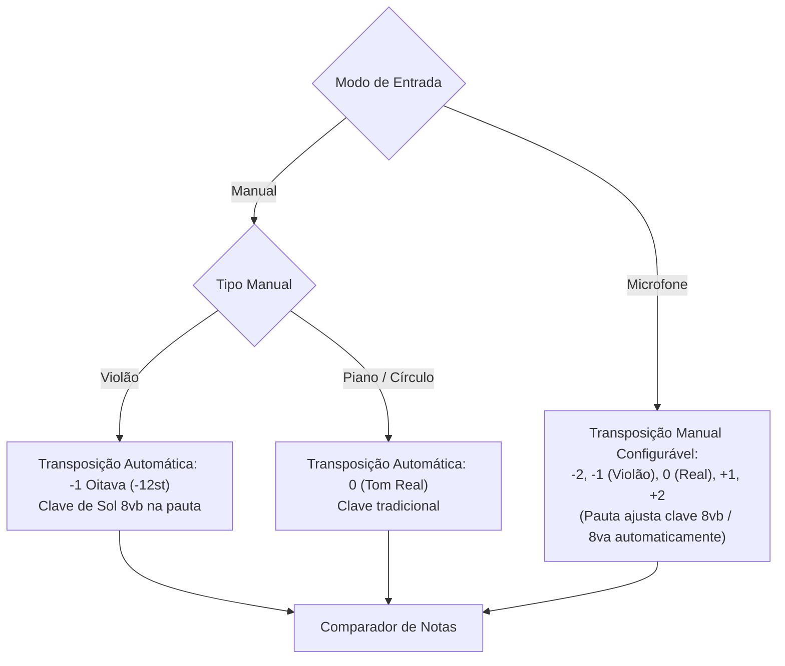

# 🏛️ Arquitetura do Sistema & Fluxo de Dados

Este documento descreve a estrutura interna, as camadas funcionais e o ciclo de vida do processamento de dados do **MusicTrainer**.

---

## 1. Módulos e Estrutura de Diretórios

```
MusicTrainer/
├── docs/                      # Documentação técnica e manuais
├── src/
│   ├── audio/                 # Motor de áudio em tempo real e detecção de frequência
│   │   ├── AudioEngine.ts     # Gerenciamento de AudioContext, microfone e streams
│   │   ├── pitchDetection.ts  # Algoritmo de detecção de frequência fundamental (YIN / AMDF)
│   │   └── noteFrequencies.ts # Conversão de frequências, MIDI, Pitch Classes e nomes (C/Dó)
│   ├── components/            # Componentes visuais e interativos
│   │   ├── ChapterSelectScreen.tsx    # Seleção de capítulos, progresso e estatísticas
│   │   ├── ChapterTrainingScreen.tsx  # Tela principal de treino, HUD e listeners
│   │   ├── inputs.tsx                 # PianoKeyboard, GuitarFretboard, CircleOfFifths, Glyphs
│   │   ├── SheetMusicDisplay.tsx      # Renderizador contínuo e responsivo VexFlow 5 (inclui Grand Staff)
│   │   ├── SettingsModal.tsx          # Modal de calibração, temas e parâmetros de microfone
│   │   ├── SetupWizard.tsx            # Assistente inicial de calibração dinâmica
│   │   ├── ThemeSettings.tsx          # Seletor e customizador de paletas de cores e fontes
│   │   ├── ui.tsx                     # Componentes base (Card, Button, Slider, AnimatedSection)
│   │   └── Icon.tsx                   # Sistema unificado de ícones vetoriais
│   ├── exercise/              # Modelagem pedagógica e gerador de notas
│   │   ├── curriculum.ts      # 3 Cursos (Sol, Fá, Sistema Duplo) → capítulos → níveis
│   │   └── generator.ts       # Geração procedural (pool, midiNotes, explicitNotes, grand clef)
│   ├── storage/               # Persistência de progresso e configurações
│   │   └── progressStorage.ts # Gerenciamento de histórico, notas e desbloqueios
│   ├── theme/                 # Design System e temas
│   │   ├── presets.ts         # Presets de cores (Dark, Gruvbox, Dracula, Nord, OneDark, etc.)
│   │   └── ThemeContext.tsx   # Provedor React de variáveis CSS, tema e fonte da UI
│   ├── types/                 # Interfaces e tipos TypeScript estritos
│   │   ├── exercise.ts        # Tipos de exercícios, notas, partituras e resultados
│   │   └── wizard.ts          # Tipos de configuração, calibração e áudio
│   ├── index.css              # Reset, animações de keyframe (@keyframes shrinkWidth) e tokens
│   ├── main.tsx               # Ponto de entrada da aplicação React
│   └── App.tsx                # Roteamento de estados (Wizard, Home, Seleção, Treino)
```

---

## 2. Camadas do Sistema

### 2.1. Camada de Áudio (`src/audio/`)
- **`AudioEngine`**: Implementa o padrão Singleton para gerenciar o `AudioContext` nativo da Web Audio API. Inicializa streams de entrada do microfone com cancelamento de eco (`echoCancellation: false`, `noiseSuppression: false` para manter a fidelidade harmônica dos instrumentos).
- **`pitchDetection`**: Processa buffers PCM em tempo real (2048 amostras a 44.1kHz/48kHz), aplicando o algoritmo **YIN / Autocorrelação Normalizada**. Calcula a frequência fundamental ($f_0$), confiança do pitch (0 a 1) e energia RMS do volume.
- **`noteFrequencies`**: Converte frequências para notas MIDI ($MIDI = 69 + 12 \cdot \log_2(f / A4)$) e desvios em cents. Suporta sistemas de notação anglo-saxão (`letters`: C, D, E...) e latino (`solfege`: Dó, Ré, Mi...).

---

### 2.2. Camada de Partitura (`src/components/SheetMusicDisplay.tsx`)
- Utiliza o **VexFlow 5** compilado com o backend nativo SVG.
- **Renderização em Duas Camadas**:
  1. **Background Stave Layer**: Pauta contínua unificada com clave (incluindo `8vb` e `8va` quando a transposição de oitava está ativa) e armadura de clave dinâmica calculada em quintas (`keyFifths`).
  2. **Active Notes Layer**: Notas renderizadas proceduralmente com animação de rolagem horizontal contínua centrada na nota ativa (36% da largura da tela).
- **Grand Staff**: Quando o nível usa `clef: 'grand'`, o componente desenha **duas pautas simultâneas** (Sol em cima, Fá embaixo) e distribui cada nota à pauta conforme a altura (MIDI ≥ 60 → Sol; < 60 → Fá).

---

### 2.3. Camada de Treinamento (`src/components/ChapterTrainingScreen.tsx`)
Controla o fluxo de cada sessão de prática:
1. **Currículo**: `buildCurriculum()` retorna os **3 Cursos**; a interface permite navegar por Curso → Capítulo → Nível.
2. **Geração**: Invoca `generateExercise()` via `configFromExercise(level, { noteCount })`, onde `noteCount` é definido pela dificuldade (32/48/64).
3. **Avaliação**: Valida respostas por microfone ou manual; calcula precisão, tempo de reação e desvio em cents.
4. **Aprovação**: Um nível é aprovado com precisão ≥ limite da dificuldade (80/85/90%) **E** tempo médio ≤ limite (4s/3s/2s).
5. **Persistência**: Salva automaticamente o progresso (maior dificuldade completada por nível) e o histórico em `progressStorage.ts`.

---

## 3. Mecanismo de Transposição de Oitava

O sistema conta com compensação harmônica automática e manual para instrumentos transpositores:



- **Violão no modo manual**: O braço toca as notas nas alturas reais das cordas (E2 = MIDI 40 a E5 = 76). A partitura exibe a clave de Sol transpositora `8vb`, onde a nota escrita na pauta equivale a $+12$ semitons (ex: Dó central escrito na 1ª linha suplementar inferior é Dó4 na pauta, correspondendo a Dó3 tocado no violão).
- **Microfone**: O usuário pode cantar ou tocar em oitavas diferentes (ex: flauta piccolo em $+1$ oitava, violão em $-1$ oitava, contrabaixo em $-2$ oitavas), e o detector compensa o $MIDI$ antes da validação.
