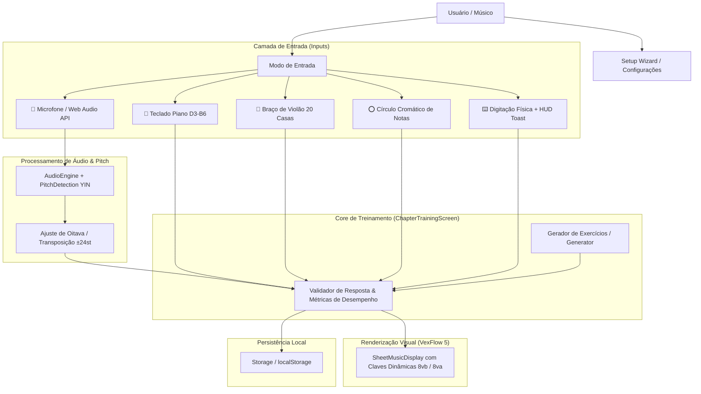

# 🎵 MusicTrainer — Documentação Técnica & Arquitetura

Bem-vindo à documentação oficial do **MusicTrainer**, uma plataforma web de alta performance para treino auditivo, leitura de partituras e percepção musical em tempo real, desenvolvida com **React 19**, **TypeScript**, **Vite**, **VexFlow 5**, **Web Audio API** e **TailwindCSS**.

---

## 📚 Índice da Documentação

A documentação está organizada nas seguintes categorias:

### 🏛️ Arquitetura (`architecture/`)
| Documento | Descrição |
| :--- | :--- |
| [**ARCHITECTURE.md**](./architecture/ARCHITECTURE.md) | **Estrutura atual exata do sistema**: módulos, slices, camadas, fluxo de dados, políticas de arquitetura e guia de novas features. |

### 👨‍💻 Desenvolvimento (`development/`)
| Documento | Descrição |
| :--- | :--- |
| [**DEVELOPER_GUIDE.md**](./development/DEVELOPER_GUIDE.md) | Guia prático: instalação, comandos, como adicionar features/temas/instrumentos/ícones e WebMIDI. |
| [**GUIDELINES.md**](./development/GUIDELINES.md) | Padrões de código, arquitetura React, políticas de estrutura, design visual e tipografia musical (SMuFL). |

### 🎼 Estrutura Atual do Sistema (`system/`)
| Documento | Descrição |
| :--- | :--- |
| [**CURRICULUM.md**](./system/CURRICULUM.md) | **Especificação completa do currículo atual** — 3 Cursos, capítulos, níveis, notas e armaduras. |
| [**CURRICULUM_AND_EXERCISES.md**](./system/CURRICULUM_AND_EXERCISES.md) | Modelagem pedagógica, gerador procedural de notas e guia de extensão do currículo. |
| [**INPUT_MODES.md**](./system/INPUT_MODES.md) | Especificação dos modos de entrada: Microfone (Pitch Tracking), Piano, Violão, Círculo de Notas e Digitação com HUD. |

### 🗺️ Planos & Dívida Técnica (`plan/`)
| Documento | Descrição |
| :--- | :--- |
| [**REFACTOR_PLAN.md**](./plan/REFACTOR_PLAN.md) | Plano e registro da refatoração arquitetural (alias `@/`, `shared/domain`, barrels, worklet build-safe). |
| [**INCONSISTENCIES_BUGS_LEGACY.md**](./plan/INCONSISTENCIES_BUGS_LEGACY.md) | Registro central de inconsistências, bugs e legado/dívidas técnicas a resolver. |
| [**PLANO_DE_ACAO.md.legacy**](./plan/PLANO_DE_ACAO.md.legacy) | Plano de ação histórico (2026-08-14) — **desatualizado, mantido apenas como referência histórica**. |

> 💡 **Dica**: comece por [ARCHITECTURE.md](./architecture/ARCHITECTURE.md) para entender a estrutura atual, depois [DEVELOPER_GUIDE.md](./development/DEVELOPER_GUIDE.md) para contribuir.

---

## 🏛️ Visão Geral do Sistema

---

## ⚡ Pilha Tecnológica (Tech Stack)

- **Framework Principal**: [React 19](https://react.dev/) + [TypeScript](https://www.typescriptlang.org/) (Strict Mode)
- **Bundler & Dev Server**: [Vite](https://vitejs.dev/)
- **Renderizador de Partituras**: [VexFlow 5](https://vexflow.com/) (Backend SVG de alta fidelidade)
- **Áudio em Tempo Real**: Web Audio API nativa com algoritmo de detecção de pitch YIN / Autocorrelação com calibração A4 (430–450Hz)
- **Estilização**: TailwindCSS + Design System baseado em tokens de variáveis CSS e paletas HSL temáticas
- **Ícones e Glifos**: FontAwesome (SVG Icons locais) + MDI / SMuFL Canonical Vector Glyphs para acidentes musicais (♯, ♭, ♮)
- **Persistência**: Web LocalStorage encapsulado com tipagem forte e migração transparente
