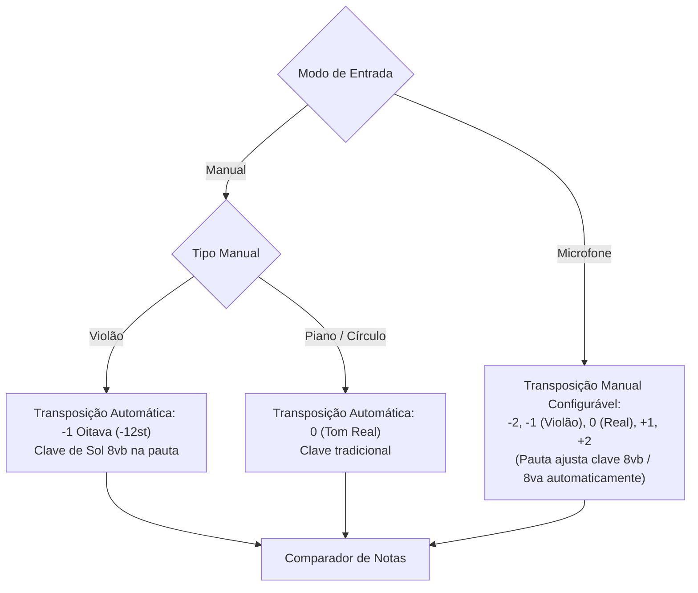

# 🏛️ Arquitetura do Sistema & Fluxo de Dados

Este documento descreve a estrutura interna, as camadas funcionais e o ciclo de vida do processamento de dados do **MusicTrainer**.

---

## 1. Módulos e Estrutura de Diretórios

```
MusicTrainer/
├── docs/                       # Documentação (portal README + subpastas temáticas)
│   ├── README.md               #   Índice/portal
│   ├── architecture/           #   Arquitetura (estado atual exato)
│   ├── development/            #   Guias de dev & padrões
│   ├── system/                 #   Estrutura atual (currículo, modos de entrada)
│   └── plan/                   #   Planos, refactor e dívida técnica
├── src/
│   ├── audio/                  # Slice: Motor de áudio em tempo real (auto-contido)
│   │   ├── index.ts            #   Superfície pública do slice (barrel)
│   │   ├── AudioEngine.ts      #   Gerenciamento de AudioContext, microfone e streams
│   │   ├── audioWorkletProcessor.ts  #   Processador AudioWorklet (compilado à parte)
│   │   ├── audioWorkletTypes.d.ts    #   Typings globais do AudioWorklet
│   │   └── noteFrequencies.ts #   Conversão de frequências, MIDI, Pitch Classes e nomes (C/Dó)
│   ├── components/             # Slice: UI de telas & widgets
│   │   ├── index.ts            #   Superfície pública do slice (barrel)
│   │   ├── AppLayout.tsx       #   Layout base das telas
│   │   ├── ChapterTrainingScreen.tsx  # Tela principal de treino, HUD, seleção de curso/capítulo
│   │   ├── HistoryScreen.tsx   #   Histórico de sessões
│   │   ├── HomeScreen.tsx      #   Tela inicial / resume de último exercício
│   │   ├── inputs.tsx          #   PianoKeyboard, GuitarFretboard, CircleOfFifths, Glyphs
│   │   ├── SheetMusicDisplay.tsx     # Renderizador contínuo e responsivo VexFlow 5 (inclui Grand Staff)
│   │   ├── SettingsModal.tsx   #   Modal de calibração, temas e parâmetros de microfone
│   │   ├── SetupWizard.tsx     #   Assistente inicial de calibração dinâmica
│   │   ├── ThemeSettings.tsx   #   Seletor e customizador de paletas de cores e fontes
│   │   ├── ui.tsx              #   Componentes base (Card, Button, Slider, AnimatedSection)
│   │   └── Icon.tsx            #   Sistema unificado de ícones vetoriais
│   ├── exercise/               # Slice: Modelagem pedagógica
│   │   ├── index.ts            #   Superfície pública do slice (barrel)
│   │   ├── curriculum.ts       #   3 Cursos (Sol, Fá, Sistema Duplo) → capítulos → níveis
│   │   └── generator.ts        #   Geração procedural (pool, midiNotes, explicitNotes, grand clef)
│   ├── shared/                 # ★ SHARED STACK — código cross-cutting, mínimo e explícito
│   │   └── domain/             #   Tipos/constantes canônicas de domínio (fonte única de verdade)
│   │       ├── index.ts        #   Barrel (@/shared/domain)
│   │       ├── clef.ts         #   Clef
│   │       ├── difficulty.ts   #   Difficulty
│   │       ├── inputMode.ts    #   InputMode
│   │       ├── pitch.ts        #   PitchData
│   │       ├── iconName.ts     #   IconName (union de ícones)
│   │       ├── instrumentType.ts  #   InstrumentType
│   │       ├── manualType.ts      #   ManualType
│   │       └── instruments.ts     #   INSTRUMENTS + MANUAL_TYPES (catálogos)
│   ├── storage/                # Slice: Persistência (localStorage)
│   │   └── storage.ts          #   Histórico, notas, desbloqueios, tema, progresso
│   ├── theme/                  # Shared stack: Design System
│   │   ├── ThemeContext.tsx    #   Provedor React de variáveis CSS, tema e fonte da UI
│   │   ├── apply.ts            #   Aplicação de tema → variáveis CSS (:root)
│   │   ├── presets.ts          #   Presets de cores + defaultThemeConfig
│   │   └── types.ts            #   Tipos do tema (ThemeConfig, CustomTheme, etc.)
│   ├── types/                  # Tipos de fluxo (wizard); re-exporta domínio
│   │   ├── index.ts            #   Re-export de domínio + ExerciseNote/Config/Result
│   │   └── wizard.ts           #   WizardConfig e tipos de calibração
│   ├── index.css               # Reset, animações de keyframe (@keyframes shrinkWidth) e tokens
│   ├── main.tsx                # Ponto de entrada da aplicação React
│   └── App.tsx                 # Roteamento de estados (Home, Wizard, Training, History)
```

> **Alias**: `@/` resolve para `src/` (configurado em `vite.config.ts` e `tsconfig.json`). Imports entre slices usam `@/...`; imports intra-slice podem usar relativos.

---

## 1.1 Políticas de Arquitetura

1. **Alias `@/` obrigatório** entre slices. Nunca `../` para cruzar limite de slice.
2. **Dependência de slices** — um slice só importa de: shared stacks (`shared/`, `theme/`, `types/`), ou do barrel (`index.ts`) de outro slice. Nunca internals.
3. **Superfície pública** — cada slice expõe tudo via `index.ts` (barrel). Consumidores importam apenas do barrel.
4. **Domínio canônico** — `shared/domain/` é a **fonte única** para `Clef`, `Difficulty`, `InputMode`, `PitchData`, `IconName`, `InstrumentType`, `ManualType`, `INSTRUMENTS`, `MANUAL_TYPES`. Não duplique; importe de lá.
5. **Anti-círculo** — proibido `storage` importar de `theme/apply` (lógica). Storage depende apenas de `theme/presets`/`theme/types` (dados). `defaultThemeConfig` vive em `theme/presets.ts`.
6. **Nomenclatura** — `kebab-case.ts` para módulos; `PascalCase.tsx` para componentes; tipos em `camelCase.ts`; barrels chamam-se `index.ts`.

---

## 2. Camadas do Sistema

### 2.1. Camada de Áudio (`src/audio/`)
- **`AudioEngine`**: Implementa o padrão Singleton para gerenciar o `AudioContext` nativo da Web Audio API. Inicializa streams de entrada do microfone com cancelamento de eco (`echoCancellation: false`, `noiseSuppression: false` para manter a fidelidade harmônica dos instrumentos). Registra o worklet via `new URL(..., import.meta.url)` (build-safe).
- **`audioWorkletProcessor`**: Processa buffers PCM em tempo real (2048 amostras a 44.1kHz/48kHz), aplicando o algoritmo **YIN / Autocorrelação Normalizada**. Calcula a frequência fundamental ($f_0$), confiança do pitch (0 a 1) e energia RMS do volume. Compilado separadamente (`tsconfig.worklet.json`) e emitido como asset no build de produção.
- **`noteFrequencies`**: Converte frequências para notas MIDI ($MIDI = 69 + 12 \cdot \log_2(f / A4)$) e desvios em cents. Suporta sistemas de notação anglo-saxão (`letters`: C, D, E...) e latino (`solfege`: Dó, Ré, Mi...).

---

### 2.2. Camada de Partitura (`src/components/SheetMusicDisplay.tsx`)
- Utiliza o **VexFlow 5** compilado com o backend nativo SVG.
- **Renderização em Duas Camadas**:
  1. **Background Stave Layer**: Pauta contínua unificada com clave (incluindo `8vb` e `8va` quando a transposição de oitava está ativa) e armadura de clave dinâmica calculada em quintas (`keyFifths`).
  2. **Active Notes Layer**: Notas renderizadas proceduralmente com animação de rolagem horizontal contínua centrada na nota ativa (36% da largura da tela).
- **Grand Staff**: Quando o nível usa `clef: 'grand'`, o componente desenha **duas pautas simultâneas** (Sol em cima, Fá embaixo) e distribui cada nota à pauta conforme a altura (MIDI ≥ 60 → Sol; < 60 → Fá).

---

### 2.3. Camada de Treinamento (`src/components/ChapterTrainingScreen.tsx`)
Controla o fluxo de cada sessão de prática:
1. **Currículo**: `buildCurriculum()` retorna os **3 Cursos**; a interface permite navegar por Curso → Capítulo → Nível.
2. **Geração**: Invoca `generateExercise()` via `configFromExercise(level, { noteCount })`, onde `noteCount` é definido pela dificuldade (32/48/64).
3. **Avaliação**: Valida respostas por microfone ou manual; calcula precisão, tempo de reação e desvio em cents.
4. **Aprovação**: Um nível é aprovado com precisão ≥ limite da dificuldade (80/85/90%) **E** tempo médio ≤ limite (4s/3s/2s).
5. **Persistência**: Salva automaticamente o progresso (maior dificuldade completada por nível) e o histórico em `src/storage/storage.ts`.

---

### 2.4. Camada de Navegação & Telas (`src/App.tsx` + `src/components/`)
- **Sem router** — o `App.tsx` usa estado `useState<Screen>` com 4 telas: `'home' | 'wizard' | 'training' | 'history'`, renderizadas condicionalmente sob o `ThemeProvider`.
- **Primeiro acesso**: se não houver config salva (`loadConfig()`), inicia direto no `wizard`; caso contrário, `home`.
- **Telas**:
  - `SetupWizard` — assistente de calibração (mic/manual), completa via `onComplete` → `saveConfig` + volta para `home`.
  - `HomeScreen` — tela inicial; retoma o último exercício treinado e mostra "Concluído"; navega para wizard/treino/histórico.
  - `ChapterTrainingScreen` — treino (Curso → Capítulo → Nível), HUD, seleção de dificuldade; ao sair recarrega o histórico.
  - `HistoryScreen` — histórico de sessões com limpeza (`clearHistory`).
- **Estado global de tema**: `ThemeProvider` (contexto) resolve e aplica o tema a variáveis CSS em `:root`.

---

### 2.5. Camada de Persistência (`src/storage/storage.ts`)
Encapsula todo o `localStorage` com tipagem forte e chaves versionadas:
- `music-trainer:config` — configuração do wizard.
- `music-trainer:history` — histórico de sessões (cap 50).
- `music-trainer:theme` — tema escolhido.
- `music-trainer:progress` (+ `progress-version`) — maior dificuldade aprovada por exercício.
- `music-trainer:last-exercise` — último exercício treinado (retomada).
- **`CURRICULUM_VERSION`**: ao alterar IDs do currículo, incrementar para resetar progresso obsoleto.
- **Regra**: componentes nunca acessam `localStorage` direto — usam as funções de `@/storage`.

---

### 2.6. Camada de Temas / Design System (`src/theme/`)
- `types.ts` — tipos `ThemeConfig`, `CustomTheme`, `ThemePreset`, `UIFontId`, `UI_FONTS`, `ACCENT_AUTO`.
- `presets.ts` — `PRESET_THEMES` (18 presets dark/light), `PRESET_LIST`, `PRESET_NAMES`, `DEFAULT_THEME_CONFIG`, `DEFAULT_UI_FONT` e `defaultThemeConfig()` (fonte única p/ storage).
- `apply.ts` — `resolveTheme(config)` e `applyTheme(theme, useAccentText, fontId)` (aplica variáveis CSS em `:root`). Não exporta mais `defaultThemeConfig` (movido p/ `presets.ts`).
- `ThemeContext.tsx` — provedor React; carrega/salva tema via `storage` e reaplica as variáveis CSS.

---

## 3. Mecanismo de Transposição de Oitava

O sistema conta com compensação harmônica automática e manual para instrumentos transpositores:



- **Violão no modo manual**: O braço toca as notas nas alturas reais das cordas (E2 = MIDI 40 a E5 = 76). A partitura exibe a clave de Sol transpositora `8vb`, onde a nota escrita na pauta equivale a $+12$ semitons (ex: Dó central escrito na 1ª linha suplementar inferior é Dó4 na pauta, correspondendo a Dó3 tocado no violão).
- **Microfone**: O usuário pode cantar ou tocar em oitavas diferentes (ex: flauta piccolo em $+1$ oitava, violão em $-1$ oitava, contrabaixo em $-2$ oitavas), e o detector compensa o $MIDI$ antes da validação.

---

## 9. Guia — Como Adicionar uma Nova Feature (plug-and-play)

1. **Crie um slice** em `src/<feature>/` com layout interno consistente (ex: `components/`, `logic/`, `types/`).
2. **Exporte a superfície pública** num `index.ts` (barrel) com `export *` (ou exports explícitos).
3. **Importe de shared stacks via alias**: `import { Clef } from '@/shared/domain'`, `import { applyTheme } from '@/theme/apply'`.
4. **Nunca importe internals de outro slice** — use apenas o barrel (`@/audio`, `@/exercise`, `@/components`, etc.).
5. **Novos tipos de domínio**: não duplique — adicione ao arquivo canônico em `src/shared/domain/` e re-exporte (ex: adicione `Clef` em `clef.ts` e no barrel).
6. **Novos ícones**: adicione o literal à union `IconName` em `src/shared/domain/iconName.ts` **e** o mapeamento no `ICONS` de `src/components/Icon.tsx`.
7. **Rode `npm run build`** — deve passar sem tocar em nada do restante do app.

Se a feature precisar de persistência, use as funções de `@/storage` (nunca `localStorage` direto).
